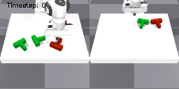

[//]: # ()
[//]: # (  
You can also find my articles on <a href="{{site.author.googlescholar}}">my Google Scholar profile</a>.
)
[//]: # ()



<h2> EC-Diffuser: Multi-Object Manipulation via Entity-Centric Behavior Generation </h2>

Carl Qi, **Dan Haramati**, Tal Daniel, Aviv Tamar, Amy Zhang \
_International Conference on Learning Representations (ICLR) 2025_ \
[[Paper](https://www.arxiv.org/abs/2412.18907)]  [[Code](https://github.com/carl-qi/EC-Diffuser)]  [[Website](https://sites.google.com/view/ec-diffuser)]

<h2> Entity-Centric Reinforcement Learning for Object Manipulation from Pixels </h2>

**Dan Haramati**, Tal Daniel, Aviv Tamar \
_International Conference on Learning Representations (ICLR) 2024_  _Spotlight (top 5%)_  \
_Goal-Conditioned Reinforcement Learning Workshop, NeurIPS 2023_  _Spotlight Talk_  \
[[Paper](https://arxiv.org/abs/2404.01220)]  [[Code](https://github.com/DanHrmti/ECRL)]  [[Website](https://sites.google.com/view/entity-centric-rl/)]  [[Talk](https://youtu.be/1YJCWyLcGHk?t=1)]

  
<h1> Workshop Papers </h1>

<h2> Object-centric Generative Modeling for Decision Making with Deep Latent Particles </h2>
Tal Daniel\*, **Dan Haramati**\*, Aviv Tamar \
_Generative Models for Decision Making Workshop, ICLR 2024_

\* Indicates equal contribution

